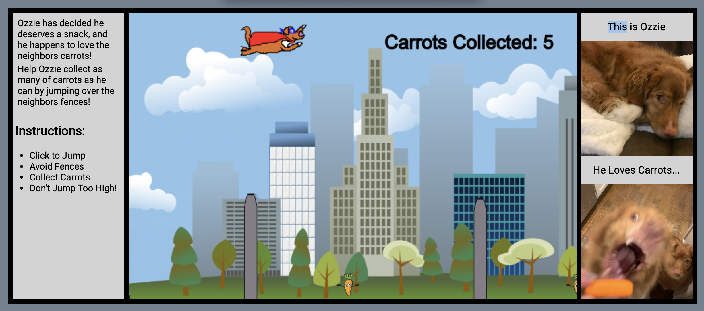

# [Ozzie's Carrot Quest](https://claytonjones839.github.io/OzziesCarrotQuest/)

## Technologies, Libraries, APIs
- Vanilla JS
- HTML Canvas
- CSS

## Summary

Ozzie's Carrot Quest is a javacript game featuring a dog named Ozzie as the main character. Ozzie's goal is to collect as many carrots as possible while also avoiding objects.





```javascript
    randomCarrot(x) {
        const carrot = {
            bottomCarrot: {
                left: x,
                right: CONSTANTS.CARROT_WIDTH + x,
                top: 455,
                bottom: this.dimensions.height
            },
            passed: false
        };
        return carrot
    }
```